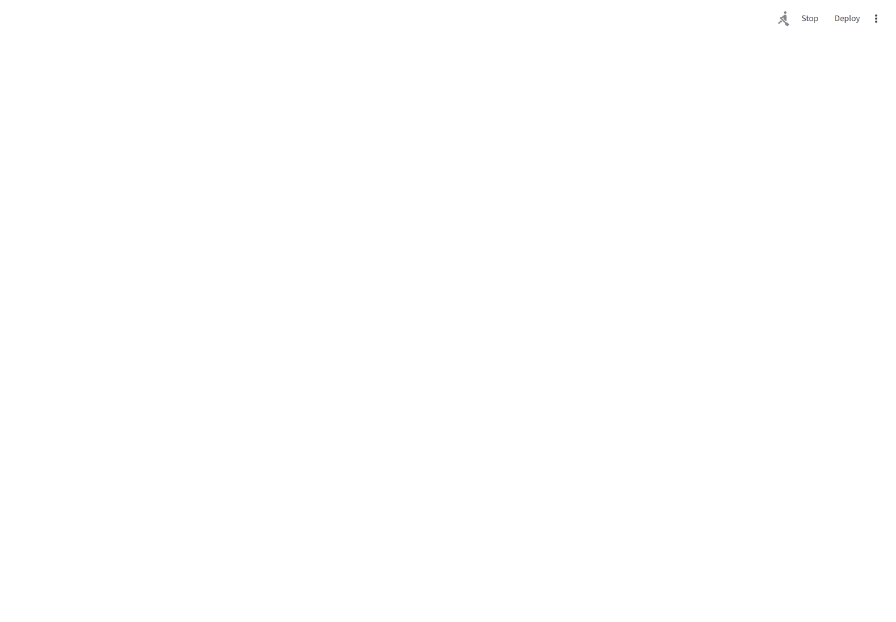
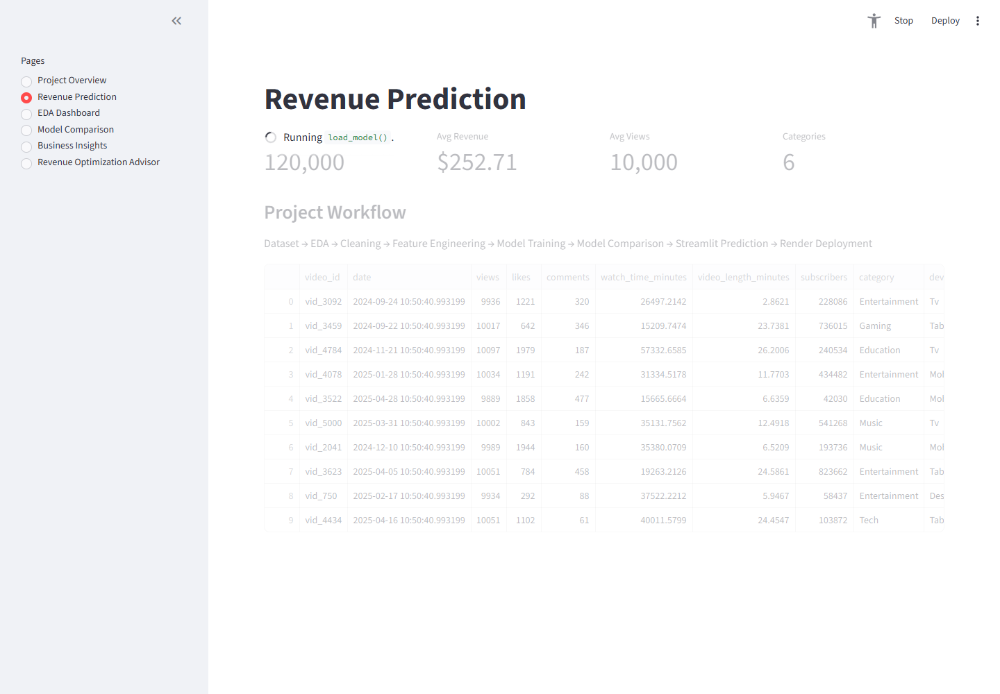
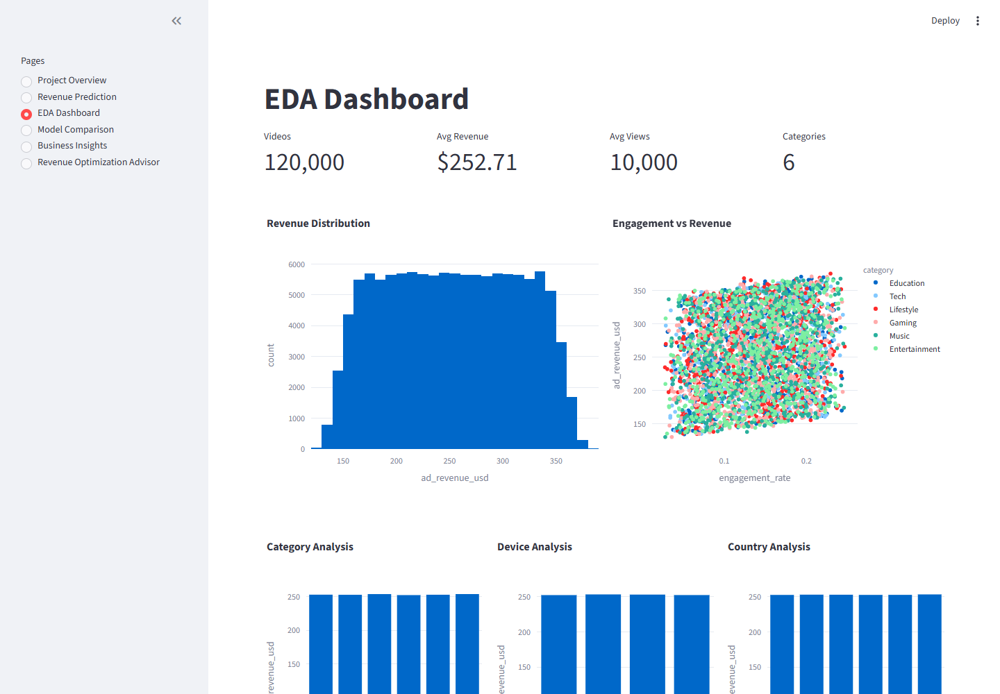
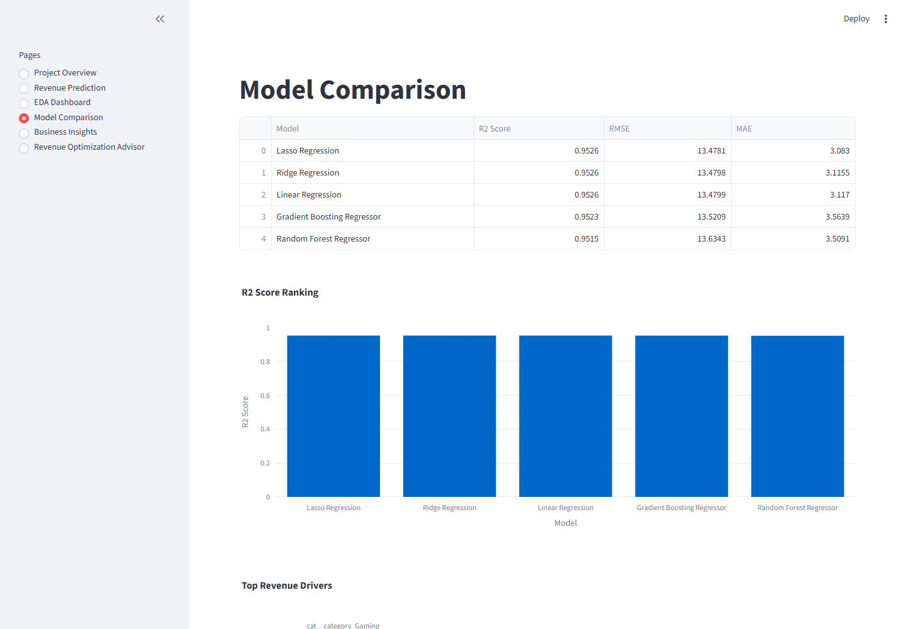
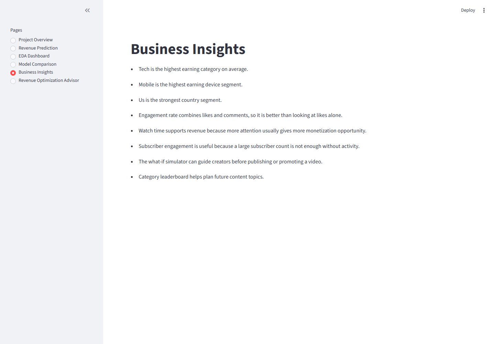
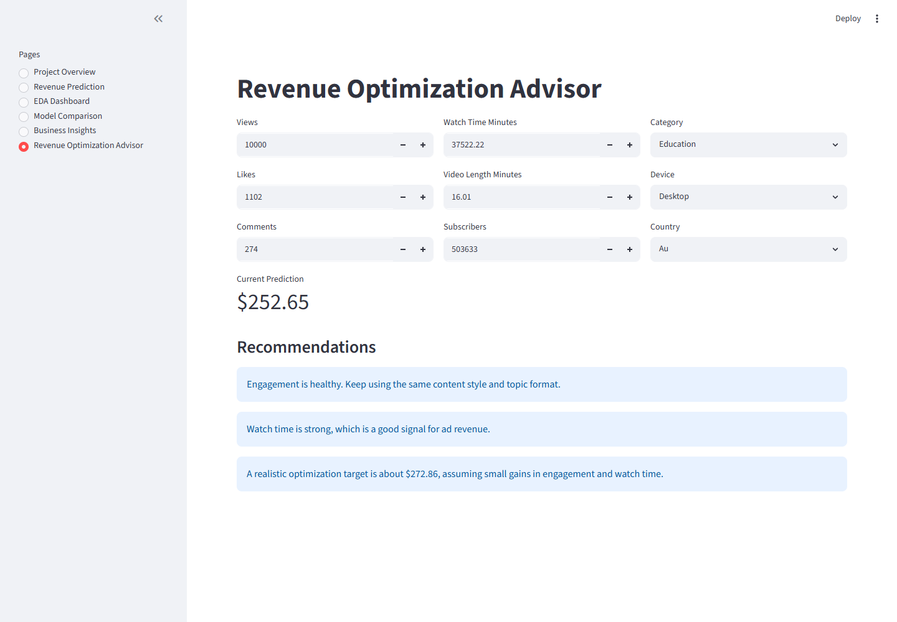

# Content Monetization Modeler

Content Monetization Modeler is a machine learning project that predicts YouTube ad revenue (`ad_revenue_usd`) from video performance metrics and contextual information.

The project is intentionally simple and explainable. It uses Python scripts for cleaning and training, scikit-learn for modeling, joblib for saved artifacts, and Streamlit for the user interface.

## Problem Statement

Creators and media teams want to estimate how much ad revenue a YouTube video may generate. This project predicts video-level ad revenue using views, likes, comments, watch time, subscribers, category, device, and country.

Because the target value is continuous, this is a regression problem.

## Dataset Description

The dataset contains 122,400 records and 12 columns:

- `video_id`, `date`
- `views`, `likes`, `comments`
- `watch_time_minutes`, `video_length_minutes`
- `subscribers`
- `category`, `device`, `country`
- `ad_revenue_usd`

The raw dataset is stored at `data/raw/youtube_ad_revenue_dataset.csv`.

## Technologies Used

- Python
- Pandas, NumPy
- Matplotlib, Seaborn, Plotly
- Scikit-learn
- Pickle / Joblib
- Streamlit
- Git and GitHub
- Render

## Project Structure

```text
content-monetization-modeler/
|-- data/
|   |-- raw/
|   `-- processed/
|-- notebooks/
|   `-- Content_Monetization_Modeler.ipynb
|-- src/
|   |-- preprocessing.py
|   |-- feature_engineering.py
|   |-- model_training.py
|   |-- evaluation.py
|   `-- prediction.py
|-- models/
|   |-- best_model.pkl
|   |-- trained_model.pkl
|   |-- scaler.pkl
|   `-- model_metadata.pkl
|-- reports/
|   |-- figures/
|   |-- screenshots/
|   `-- results/
|-- app/
|   `-- app.py
|-- app.py
|-- build_project.py
|-- requirements.txt
|-- render.yaml
`-- README.md
```

## Data Cleaning

The project performs these cleaning steps:

- Missing numerical values are filled using median values.
- Duplicate records are removed.
- Numerical outliers are capped using the IQR method.
- Date values are converted to datetime format.
- Category, device, and country text values are cleaned consistently.

These choices are simple, explainable, and suitable for a fresher-level data science project.

## Feature Engineering

The following features were created:

- Engagement Rate = `(likes + comments) / views`
- Likes Per View = `likes / views`
- Comments Per View = `comments / views`
- Watch Time Efficiency = `watch_time_minutes / video_length_minutes`
- Interaction Score = `0.7 * likes + 1.3 * comments`
- Subscriber Engagement Score = `(likes + comments) / subscribers`

These features connect directly to creator performance and are easy to explain during viva.

## Models Trained

Exactly five regression models were trained and compared:

| Rank | Model | R2 Score | RMSE | MAE |
|---:|---|---:|---:|---:|
| 1 | Lasso Regression | 0.9526 | 13.4781 | 3.0830 |
| 2 | Ridge Regression | 0.9526 | 13.4798 | 3.1155 |
| 3 | Linear Regression | 0.9526 | 13.4799 | 3.1170 |
| 4 | Gradient Boosting Regressor | 0.9523 | 13.5209 | 3.5639 |
| 5 | Random Forest Regressor | 0.9515 | 13.6343 | 3.5091 |

Lasso Regression was selected because it achieved the highest R2 score and lowest error while remaining simple and explainable.

## Streamlit Application

The app includes six pages:

1. Project Overview
2. Revenue Prediction
3. EDA Dashboard
4. Model Comparison
5. Business Insights
6. Revenue Optimization Advisor

Beginner-friendly innovations included:

- Revenue Optimization Advisor
- Revenue Performance Score
- Category Revenue Leaderboard
- Top Revenue Drivers
- What-if style input simulator

## Application Screenshots

### Project Overview



### Revenue Prediction



### EDA Dashboard



### Model Comparison



### Business Insights



### Revenue Optimization Advisor



## Installation

```bash
pip install -r requirements.txt
```

## Run Locally

```bash
streamlit run app.py
```

Alternative:

```bash
streamlit run app/app.py
```

## Rebuild the Project

```bash
python build_project.py
```

This regenerates cleaned data, model artifacts, figures, reports, and the notebook.

## Render Deployment

Use the included `render.yaml`, or configure Render manually:

- Build Command: `pip install -r requirements.txt`
- Start Command: `streamlit run app/app.py --server.port $PORT --server.address 0.0.0.0`

Deployment URL:

```text
Add the Render URL here after deployment.
```

Suggested deployment steps:

1. Push this repository to GitHub.
2. Create a new Render Web Service.
3. Connect the GitHub repository.
4. Use the build and start commands above.
5. Copy the deployed app URL into this README.

## Reports

Important generated outputs:

- `reports/results/model_comparison.csv`
- `reports/results/eda_cleaning_report.md`
- `reports/results/business_insights.md`
- `reports/results/evaluation_preparation.md`
- `reports/results/interview_attack_simulation.md`
- `reports/results/feature_importance.csv`
- `reports/figures/`
- `reports/screenshots/`

## Business Insights Summary

- Tech has the highest average revenue among categories.
- Mobile traffic gives the highest average revenue by device.
- US is the strongest country by average revenue.
- Watch time is the strongest numerical revenue driver.
- Engagement rate and interaction score help explain viewer interest.
- Subscriber count is useful, but subscriber engagement gives better context.

## Future Scope

- Add upload hour and publishing day features.
- Compare performance across different time periods.
- Add residual analysis in the app.
- Add a confidence range around revenue predictions.
- Improve app styling based on evaluator feedback.

## Suggested Commit Messages

- `Initial project structure and dataset setup`
- `Add preprocessing and feature engineering pipeline`
- `Train and compare five regression models`
- `Add Streamlit monetization dashboard`
- `Add reports, notebook, and deployment configuration`

## Repository Description

Machine learning Streamlit project for predicting YouTube ad revenue with EDA, feature engineering, model comparison, business insights, and Render deployment setup.
